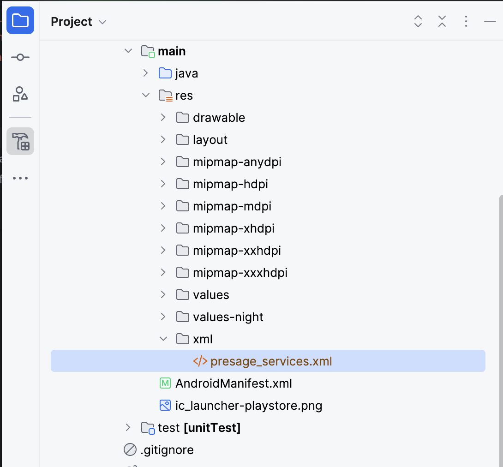

# SmartSpectra SDK for Android

## Integration Guide Overview

This guide provides instructions for integrating and utilizing the Presage SmartSpectra SDK publicly hosted on Maven in your Android application to measure physiology metrics.

The app contained in this repo is an example of pulling and using the SmartSpectra SDK from Maven. It should run out of the box as long as your API key is provided.

## Table of Contents

- [Prerequisites](#prerequisites)
- [Quick Start for Android demo app](#quick-start-guide-to-using-the-demo-app)
- [Integration in your app](#integration-in-your-own-app)
- [Usage](#usage)
- [Bugs & Troubleshooting](#bugs--troubleshooting)

## Prerequisites

- Android Studio Giraffe or later
- Minimum SDK level 26

### Using Git LFS

This repository utilizes Git Large File Storage (LFS) for managing binary files such as .so, .jar, .tflite, etc.

To use Git LFS:

1. Ensure Git LFS is installed [docs.github.com](https://docs.github.com/en/repositories/working-with-files/managing-large-files/installing-git-large-file-storage).
2. Run `git lfs install`. This step is only required once after installation.
3. If you've installed Git LFS after already cloning this repository, execute `git lfs pull`.
Git LFS functions similarly to `.gitignore`. The configuration for files managed as LFS objects is in the `.gitattributes` file.

### Authentication

You'll need either an API key or Oauth config to use the SmartSpectra Android SDK. You can find instructions on how to do that [here](../docs/authentication.md)

- **API Key Option**: Add your API key to the [MainActivity.kt](samples/demo-app/src/main/java/com/presagetech/smartspectra_example/MainActivity.kt) file by replacing the placeholder `"YOUR_API_KEY"`.
- **Oauth Config Option**: Currently only supported for playstore releases. With the downloaded Oauth xml config from obtained during [Authentication](../docs/authentication.md) and place into your app's `src/main/res/xml` directory.


> **NOTE**
> Oauth config is currently only supported for playstore releases.

## Quick Start Guide to Using the Demo App

1. Clone the repository and open the Android project in Android Studio:

    ```bash
    git clone https://github.com/Presage-Security/SmartSpectra/
    ```

2. Open the project by selecting `smartspectra/android` folder in Android Studio.
3. Add your API key to the [MainActivity.kt](samples/demo-app/src/main/java/com/presagetech/smartspectra_example/MainActivity.kt) file by replacing the placeholder `"YOUR_API_KEY"` with your actual API key.
4. The workspace setup contains internal and extenal build flavor. If you want to build with the local sdk folder, select `internalDebug` build flavor from the build variants tab.
5. Connect your Android device to your computer.
6. Select your device as the target in Android Studio.
7. Click the "Run" button in Android Studio to build and run the demo app on your device.
8. Follow the on-screen instructions in the app to conduct a measurement and view the results.

## Integration in your own app

To integrate the SmartSpectra SDK into your Android project, add the following dependency to your app's `build.gradle` file:

```gradle
dependencies {
    implementation("com.presagetech:smartspectra:1.0.20")
}
```

## Usage

### Example Code

### Initialize Components and Configure SDK Parameters

In your activity or fragment, initialize the `smartSpectraSdk` and `SmartSpectraView` (The view consists of a checkup button and result view). Also, configure the SmartSpectra SDK parameters such as the API key, SmartSpectra mode, camera position, and measurement duration.

You can obtain an Oauth config or API key from PresageTech's developer portal (<https://physiology.presagetech.com/>).

Here's a minimal example of how to use our SDK in your Android app:

```kotlin
// SmartSpectra SDK Specific Imports
import com.presagetech.smartspectra.SmartSpectraView
import com.presagetech.smartspectra.SmartSpectraSdk

class MainActivity : AppCompatActivity() {
    private lateinit var smartSpectraView: SmartSpectraView

    // (Required) Authentication. Only need to use one of the two options: API Key or OAuth below
    // Authentication with OAuth is currently only supported for apps in the Play Store
    // Option 1: (Authentication with API Key) Set the API key. Obtain the API key from https://physiology.presagetech.com. Leave default or remove if you want to use OAuth. OAuth overrides the API key.
    private var apiKey = "YOUR_API_KEY"

    // Option 2: (OAuth) If you want to use OAuth, copy the OAuth config (`presage_services.xml`) from PresageTech's developer portal (<https://physiology.presagetech.com/>) to your src/main/res/xml/ directory.
    // No additional code is needed for OAuth.

    private val smartSpectraSdk: SmartSpectraSdk = SmartSpectraSdk.getInstance().apply {
        //Required configurations: Authentication
        setApiKey(apiKey) // Use this if you are authenticating with an API key
        // If OAuth is configured, it will automatically override the API key
    }

    override fun onCreate(savedInstanceState: Bundle?) {
            super.onCreate(savedInstanceState)
            setContentView(R.layout.activity_main)

            // Setting up SmartSpectra Results/Views
            smartSpectraView = findViewById(R.id.smart_spectra_view)

    }
}
```

If you want further customization, you can add UI elements to change the SmartSpectra mode, measurement duration, and camera position at runtime. See examples of how you can implement UI elements or programmatically change the SmartSpectra mode, measurement duration, and camera position at runtime in [MainActivity.kt](samples/demo-app/src/main/java/com/presagetech/smartspectra_example/MainActivity.kt).

```kotlin
// SmartSpectra SDK Specific Imports
import com.presagetech.smartspectra.SmartSpectraView
import com.presagetech.smartspectra.SmartSpectraMode
import com.presagetech.smartspectra.SmartSpectraSdk

class MainActivity : AppCompatActivity() {
    private lateinit var smartSpectraView: SmartSpectraView

    // define smartSpectra mode to SPOT or CONTINUOUS. Defaults to CONTINUOUS when not set
    private var smartSpectraMode = SmartSpectraMode.CONTINUOUS
    // define front or back camera to use
    private var cameraPosition = CameraSelector.LENS_FACING_FRONT
    // measurement duration (valid ranges are between 20.0 and 120.0) Defaults to 30.0 when not set
    // For continuous SmartSpectra mode currently defaults to infinite
    private var measurementDuration = 30.0

    // (Required) Authentication. Only need to use one of the two options: API Key or OAuth below
    // Authentication with OAuth is currently only supported for apps in the Play Store
    // Option 1: (Authentication with API Key) Set the API key. Obtain the API key from https://physiology.presagetech.com. Leave default or remove if you want to use OAuth. OAuth overrides the API key.
    private var apiKey = "YOUR_API_KEY"

    // Option 2: (OAuth) If you want to use OAuth, copy the OAuth config (`presage_services.xml`) from PresageTech's developer portal (<https://physiology.presagetech.com/>) to your src/main/res/xml/ directory.
    // No additional code is needed for OAuth.

    // get instance of SmartSpectraSdk and apply optional configurations
    private val smartSpectraSdk: SmartSpectraSdk = SmartSpectraSdk.getInstance().apply {
        //Required configurations: Authentication
        setApiKey(apiKey) // Use this if you are authenticating with an API key
        // If OAuth is configured, it will automatically override the API key

        // Optional configurations
        // Valid range for spot time is between 20.0 and 120.0
        setMeasurementDuration(measurementDuration)
        setShowFps(false)
        //Recording delay defaults to 3 if not provided
        setRecordingDelay(3)

        // smartSpectra mode (SPOT or CONTINUOUS. Defaults to CONTINUOUS when not set)
        setSmartSpectraMode(smartSpectraMode)

        // select camera (front or back, defaults to front when not set)
        setCameraPosition(cameraPosition)

        // Optional: Only need to set it if you want to access face mesh points
        setMeshPointsObserver { meshPoints ->
            handleMeshPoints(meshPoints)
        }

        // Optional: Only need to set it if you want to access metrics to do any processing
        setMetricsBufferObserver { metricsBuffer ->
            handleMetricsBuffer(metricsBuffer)
        }
    }

    override fun onCreate(savedInstanceState: Bundle?) {
            super.onCreate(savedInstanceState)
            setContentView(R.layout.activity_main)

            // Setting up SmartSpectra Results/Views
            smartSpectraView = findViewById(R.id.smart_spectra_view)

    }
}
```

## SmartSpectra Mode

The SmartSpectra SDK supports two modes:

- Spot Mode (`SmartSpectraMode.SPOT`): In this mode, the SDK will take a single measurement for the specified duration.
- Continuous Mode (`SmartSpectraMode.CONTINUOUS`): In this mode, the SDK will continuously take measurements for the specified duration. Currently defaults to infinite duration and manual stop. During continuous mode, live pulse and breathing rate is displayed; along with live plots of the pulse and breathing trace.

## Switching SmartSpectra Mode, Measurement Duration, and Camera Position at Runtime

See examples of how you can implement UI elements or programmatically change the SmartSpectra mode, measurement duration, and camera position at runtime in [MainActivity.kt](samples/demo-app/src/main/java/com/presagetech/smartspectra_example/MainActivity.kt).

### Extracting and Using Metrics Data

To retrieve and use metrics, you can attach a `metricsBufferObserver` to get the metrics to process. Please refer to [MainActivity.kt](samples/demo-app/src/main/java/com/presagetech/smartspectra_example/MainActivity.kt) for example usage and plotting of different metrics such as pulse rate, breathing rates, etc.

```kotlin
import com.presage.physiology.proto.MetricsProto.MetricsBuffer

private val smartSpectraSdk: SmartSpectraSdk = SmartSpectraSdk.getInstance().apply {
    //...
    //...
    //...
    //...

    // Optional: Only need to set it if you want to access metrics to do any processing
    setMetricsBufferObserver { metricsBuffer ->
        handleMetricsBuffer(metricsBuffer)
    }
}

override fun onCreate(savedInstanceState: Bundle?) {
    //...
    //...
    //...
    //...
}

private fun handleMetricsBuffer(metrics: MetricsBuffer) {
    // get the relevant metrics
    val pulse = metrics.pulse
    val breathing = metrics.breathing

    // Plot the results

    // Pulse plots
    if (pulse.traceCount > 0) {
        addChart(pulse.traceList.map { Entry(it.time, it.value) },  "Pulse Pleth", false)
    }
    // Breathing plots
    if (breathing.upperTraceCount > 0) {
        addChart(breathing.upperTraceList.map { Entry(it.time, it.value) }, "Breathing Pleth", false)
    }
    // TODO: See examples of plotting other metrics in MainActivity.kt
}

```

For facemesh points, you can attach a `meshPointsObserver` to get the mesh points to process. To see a complete example of using a scatter chart to visualize the mesh points, please refer to [MainActivity.kt](samples/demo-app/src/main/java/com/presagetech/smartspectra_example/MainActivity.kt). Reference to the index of the mesh points and their corresponding face landmarks can be seen [here](https://storage.googleapis.com/mediapipe-assets/documentation/mediapipe_face_landmark_fullsize.png)

```kotlin
private val smartSpectraSdk: SmartSpectraSdk = SmartSpectraSdk.getInstance().apply {
    //...
    //...
    //...
    //...
    // Optional: Only need to set it if you want to access face mesh points
    setMeshPointsObserver { meshPoints ->
        handleMeshPoints(meshPoints)
    }
}
override fun onCreate(savedInstanceState: Bundle?) {
    //...
    //...
    //...
    //...
}
private fun handleMeshPoints(meshPoints: List<Pair<Int, Int>>) {
    Timber.d("Observed mesh points: ${meshPoints.size}")
// TODO: Update UI or handle the points as needed. See examples of plotting in MainActivity.kt
}


```

### Detailed `MetricsBuffer` Class Descriptions

> **TIP**
> If you need to use the types directly, the `MetricsBuffer` and corresponding classes are under the `com.presage.physiology.proto.MetricsProto` namespace. You can import it from `MetricsProto.MetricsBuffer` for easier usage:
>
> ```kotlin
> import com.presage.physiology.proto.MetricsProto.MetricsBuffer
> ```

`MetricsBuffer` contains the following parent classes:

```kotlin
class MetricsBuffer {
    var pulse: Pulse
    var breathing: Breathing
    var bloodPressure: BloodPressure
    var face: Face
    var metadata: Metadata
}
```

### Measurement Types

- **`Measurement` Class**: Represents a measurement with time and value:

```kotlin
class Measurement {
    var time: Float
    var value: Float
    var stable: Boolean
}
```

- **`MeasurementWithConfidence` Class**: Includes confidence with the measurement:

```kotlin
class MeasurementWithConfidence {
    var time: Float
    var value: Float
    var stable: Boolean
    var confidence: Float
}
```

- **`DetectionStatus` Class**: Used for events like apnea or face detection (blinking/talking):

```kotlin
class DetectionStatus {
    var time: Float
    var detected: Boolean
    var stable: Boolean
}
```

#### Metric Types

- **`Pulse` Class**: Contains pulse-related measurements, including rate, trace, and strict values:

```kotlin
class Pulse {
    var rateList: List<MeasurementWithConfidence>
    var traceList: List<Measurement>
    var strict: Strict
}
```

- **`Breathing` Class**: Handles breathing-related data with upper and lower traces, amplitude, apnea status, and other metrics:

```kotlin
class Breathing {
    var rateList: List<MeasurementWithConfidence>
    var upperTraceList: List<Measurement>
    var lowerTraceList: List<Measurement>
    var amplitudeList: List<Measurement>
    var apneaList: List<DetectionStatus>
    var respiratoryLineLengthList: List<Measurement>
    var inhaleExhaleRatioList: List<Measurement>
    var strict: Strict
}
```

- **`BloodPressure` Class**: Handles blood pressure measurements:

> [!CAUTION]
> Currently not available publicly, currently returned results are a duplicate of pulse pleth

```kotlin
class BloodPressure {
    var phasicList: List<MeasurementWithConfidence>
}
```

- **`Face` Class**: Includes detection statuses for blinking and talking:

```kotlin
class Face {
    var blinkingList: List<DetectionStatus>
    var talkingList: List<DetectionStatus>
}
```

- **`Metadata` Class**: Includes metadata information:

```kotlin
class Metadata {
    var id: String
    var uploadTimestamp: String
    var apiVersion: String
}
```

#### Encoding and Decoding Protobuf Messages

To serialize `MetricsBuffer` into binary format:

```kotlin
try {
    val data: ByteArray = metricsBuffer.toByteArray()
    // Send `data` to your backend or save it
} catch (e: Exception) {
    Timber.e("Failed to serialize metrics: ${e.message}")
}
```

To decode binary protobuf data into `MetricsBuffer`:

```kotlin
try {
    val decodedMetrics = MetricsBuffer.parseFrom(data)
    // Use `decodedMetrics` as needed
} catch (e: Exception) {
    Timber.e("Failed to decode metrics: ${e.message}")
}
```

## Bugs & Troubleshooting

For additional support, contact <[support@presagetech.com](mailto:support@presagetech.com)> or [submit a GitHub issue](https://github.com/Presage-Security/SmartSpectra/issues)

If, after updating the framework, you encounter something like this:


OR the `R` value in `demo-app/src/main/java/com/presagetech/smartspectra_example/MainActivity.kt` stops getting resolved by the AndroidStudio linter,

Run `Sync Project With Gradle Files` (the little icon in the top right corner with left-down-pointing arrow and some animal, possibly an elephant).
